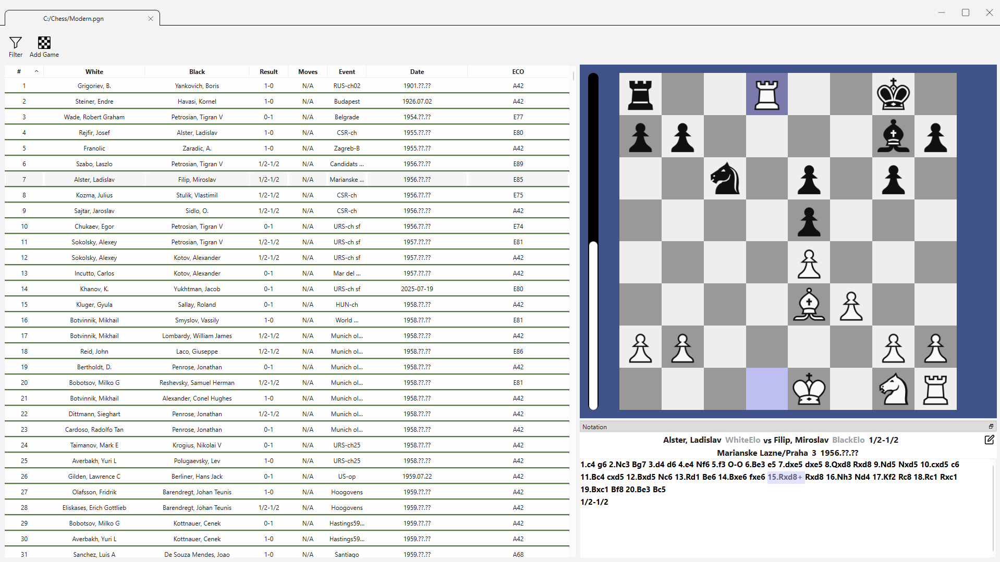
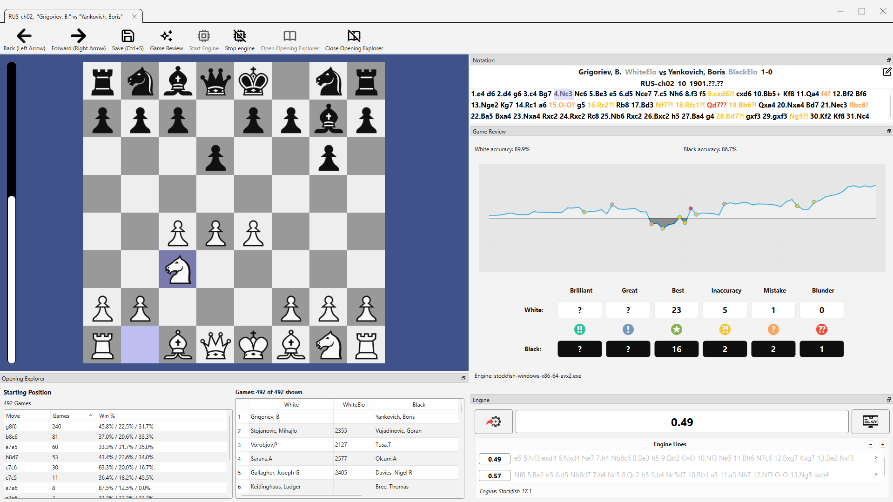

# Chess Database Viewer

A Qt-based chess game and database viewer. This application allows users to browse, manage, and analyze chess games stored in `.pgn` files, offering features such as filtering, opening analysis, variation tracking, engine analysis, and game review.




## Features

- Browse and manage multiple chess databases
- Visual game preview and board interaction
- Add, delete, and navigate moves & variations
- UCI engine support for real-time position analysis
- Explore openings and statistics from an opening database
- Game review including accuracy and move evaluation
- Multi-tab navigation for parallel games and databases

## User Guide

For detailed instructions on how to use the software, see the [User Guide](./user-guide.md).

Alternatively, you may watch the following tutorial:

[](https://www.youtube.com/embed/sOwOgN4ewTo)

## Download Link

Download from [chessmd.org](https://chessmd.org/download)

## Building Locally

### Requirements

- Qt 6.5 or higher
- C++17

### Building

To build the project:

```bash
mkdir build
cd build
cmake ..
make
```

## Chess Piece Attribution

This project uses chess piece images from [Lichess.org](https://lichess.org), available under various open licenses. The original repository can be found at [https://github.com/lichess-org/lila](https://github.com/lichess-org/lila), and the files are located under [`public/piece/`](https://github.com/lichess-org/lila/tree/master/public/piece).
