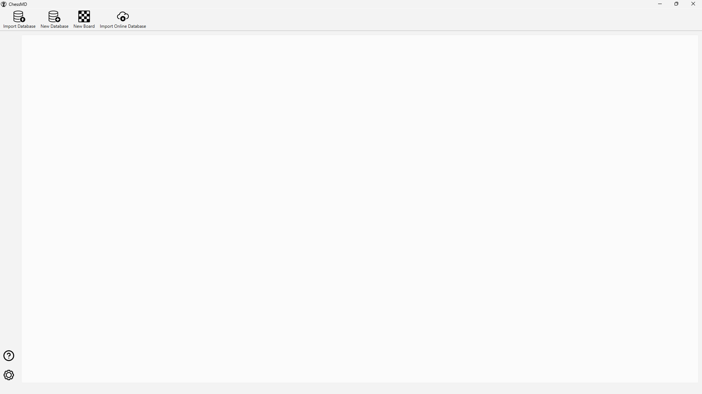
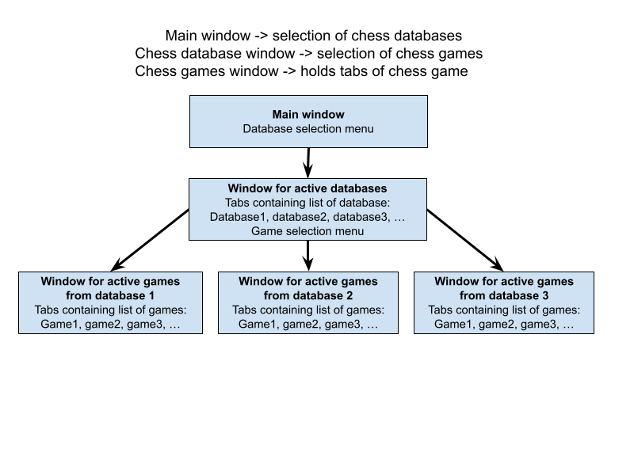
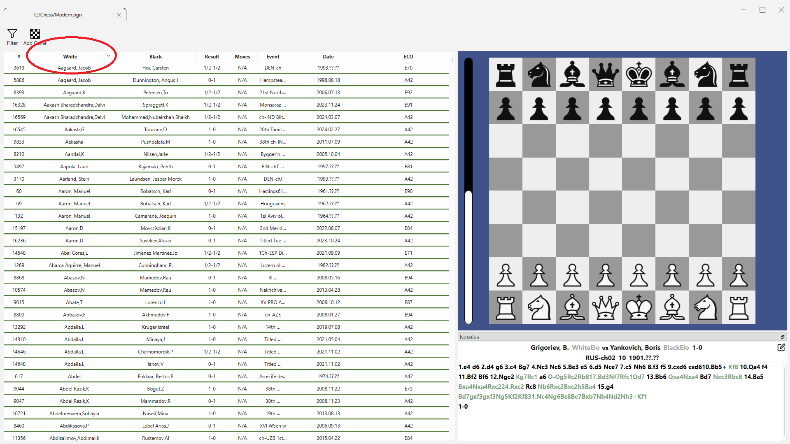
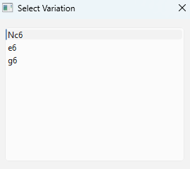
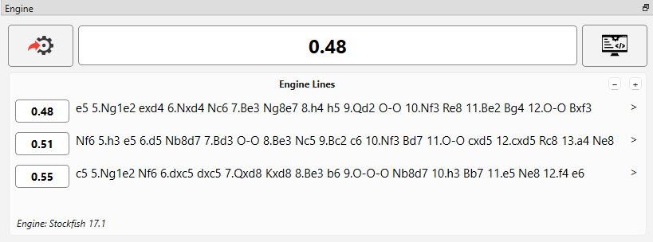

# 2.0 User Guide

The user guide will demonstrate how the software can be used.

## 2.1 Overview

The following menu will appear when the program is run:

**Figure 2.1a**: Main screen display  

This is the database library, the main menu of the software which consists of a collection of chess databases, where each database is a list of chess games. When the user double-clicks a database icon, a menu will appear displaying the games in the database:

**Figure 2.1b**: Database menu  

In the database menu, each row on the left corresponds to a chess game and each column displays basic information about each game. On the right, there is a game preview of the currently selected game. Moreover, the user may open any chess game in the database by double-clicking any row, where a new window will appear containing the chess game:

**Figure 2.1c**: Game menu  

In the game menu, the user is greeted by a chess board, a notation viewer, and an engine analysis tool.

### 2.1.1 Tab System

The user may wish to have multiple chess games and chess databases open simultaneously. The tab system has been designed to handle this requirement, where several menus can be opened within each window.

The main window consists of tabs that display chess databases. Each database is associated with a window with tabs that display each chess game.

**Figure 2.1.1a**: Tab hierarchy  

The tab hierarchy provides the framework for organising the program’s various windows.

---

## 2.2 Database Menu

The database menu displays the list of chess games in a database. It provides columns that display header information, a search & sort based on game information, and a preview that displays each game.  
(See **Figure 2.1b**)

### 2.2.1 Adding Databases

The user can add a new database by navigating to the main window of the program and clicking on “Add Database”, selecting a `.PGN` file from the user’s file system. Alternatively, the user can add a new database through the menu bar by selecting `Databases -> Add New Database`.  
(See **Figure 2.1a**)

### 2.2.2 Game Preview

The user can go through a selected game using the same interface and controls as the board menu detailed in Section 2.3. This includes stepping through moves using the forward and backward buttons or keyboard shortcuts, allowing the user to play games directly from the database preview panel.  
(See **Figure 2.1b**)

### 2.2.3 Sorting Games

The user may click on a column header to sort the games based on that column. The sorting order will reverse (e.g. from ascending to descending) after each click.

**Figure 2.2.3a**: Sorting by column headers  

### 2.2.4 Filtering Games

The user may click on the “Filter” button which will open a dialogue with filtering options. Once applied, only games that match the selected criteria will be displayed in the list.  
The user may also click on the “Reset” button to remove all active filters.

**Figure 2.2.4a**: Filter dialogue with game information  

---

## 2.3 Board Menu

The board menu provides the interface for interacting with the currently loaded chess game. It allows the user to make and navigate moves, analyze positions with engines, and view game data through the notation panel.  
(**Figure 2.1c**)

### 2.3.1 Navigating Moves

The user can navigate through the moves of a game using the arrow buttons in the toolbar or the left/right keyboard shortcuts. All moves in the game tree are displayed in the notation panel, where users can also click on specific moves to jump to them directly.

### 2.3.2 Exporting PGN and FEN

Users can copy the current game as a PGN string by clicking “Copy PGN” or the current board as an FEN string by clicking “Copy FEN”.

### 2.3.3 Making Moves and Variations

The user may add moves on the board by dragging and dropping pieces. Only legal chess moves will be added to the game tree and displayed on the notation panel.

Additionally, if a move is made from a position that already has a continuation, a variation is automatically created. When the user attempts to navigate to the next move on a position with two or more variations, a variation dialogue will appear allowing the user to choose which variation to follow.

**Figure 2.3.3a**: Variation dialogue with move selection  

### 2.3.6 Deleting Moves and Variations

The user can delete all moves after the current position including variations by clicking the toolbar button or the keyboard shortcut `]`.  
Additionally, the user can remove the current variation by clicking the toolbar button or the keyboard shortcut `Ctrl + D`.

### 2.3.7 Analyzing Positions

The active position can be analyzed using a chess engine. Upon changing a position, the engine panel will automatically provide a chess evaluation of the position along with the best move.  
The user may also manually click the “Analyse” button to trigger an engine evaluation.

The depth of the engine can be customized for speed and strength.

**Figure 2.3.7a**: Engine panel with evaluation and move suggestion  

### 2.3.8 Uploading Engines

The user can upload an external UCI-compatible chess engine of their choice by navigating to the main window and selecting `Settings -> Select Engine File`.
