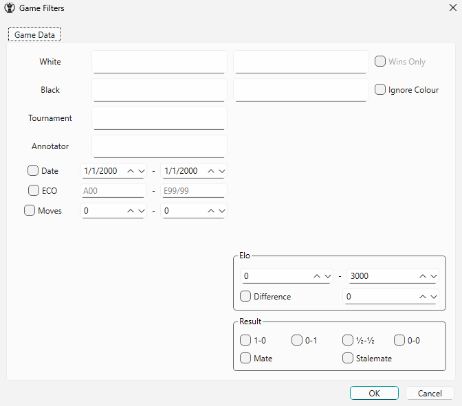

# 2.0 User Guide

The user guide will demonstrate how the software can be used.

## 2.1 Overview

The following menu will appear when the program is run:

**Figure 2.1a**: Main screen display  

This is the database library, the main menu of the software which consists of a collection of chess databases, where each database is a list of chess games. When the user double-clicks a database icon, a menu will appear displaying the games in the database:

**Figure 2.1b**: Database menu  

In the database menu, each row on the left corresponds to a chess game and each column displays basic information about each game. On the right, there is a game preview of the currently selected game which can be navigated through the notation viewer or the arrow keys. Moreover, the user may open any chess game in the database by double-clicking any row, where a new window will appear containing the chess game:

**Figure 2.1c**: Game menu  

In the game menu, the user is greeted by a chess board, a notation viewer, and options to open the Engine, Opening Explorer, and Game Review tools.

### 2.1.1 Tab System

The user may wish to have multiple chess games and chess databases open simultaneously. The tab system has been designed to handle this requirement, where several menus can be opened within each window.

The main window consists of tabs that display chess databases. Each database is associated with a window with tabs that display each chess game.

**Figure 2.1.1a**: Tab hierarchy  

The tab hierarchy provides the framework for organising the program’s various windows.

---

## 2.2 Database Menu

The database menu displays the list of chess games in a database. It provides columns that display header information, a search & sort based on game information, and a preview that displays each game.  
(See **Figure 2.1b**)

### 2.2.1 Adding Databases

The user can add a new database by navigating to the main window of the program and clicking on “Add Database”, selecting a `.PGN` file from the user’s file system.
(See **Figure 2.1a**)

### 2.2.2 Game Preview

The user can go through a selected game using the same interface and controls as the board menu detailed in Section 2.3. This includes stepping through moves using the forward and backward buttons or keyboard shortcuts, allowing the user to play games directly from the database preview panel.  
(See **Figure 2.1b**)

### 2.2.3 Sorting Games

The user may click on a column header to sort the games based on that column. The sorting order will reverse (e.g. from ascending to descending) after each click.

**Figure 2.2.3a**: Sorting by column headers  

### 2.2.4 Filtering Games

The user may click on the “Filter” button which will open a dialogue with filtering options. Once applied, only games that match the selected criteria will be displayed in the list.  

**Figure 2.2.4a**: Filter dialogue with game information  

### 2.2.5 Customizing Headers

The user may right-click on any header to access the header customization menu. The user may then add, remove, and reorder the shown headers.

**Figure 2.2.5a**: Custom headers dialogue

---

## 2.3 Board Menu

The board menu provides the interface for interacting with the currently loaded chess game. It allows the user to make and navigate moves, analyze positions with engines, explore openings through an opening database, and access the game review tool.
(**Figure 2.1c**)

### 2.3.1 Navigating Moves

The user can navigate through the moves of a game using the arrow buttons in the toolbar or the left/right keyboard shortcuts. All moves in the game tree are displayed in the notation panel, where users can also click on specific moves to jump to them directly.

### 2.3.2 Saving Edits

The user may save any edits to a game into its PGN file through the button in the toolbar or the shortcut `Ctrl + S`.

### 2.3.3 Making Moves and Variations

The user may add moves on the board by dragging and dropping pieces. Only legal chess moves will be added to the game tree and displayed on the notation panel.

Additionally, if a move is made from a position that already has a continuation, a variation is automatically created. When the user attempts to navigate to the next move on a position with two or more variations, a variation dialogue will appear allowing the user to choose which variation to follow.

**Figure 2.3.3a**: Variation dialogue with move selection  

### 2.3.4 Deleting Moves and Variations

The user can delete all moves after the current position including variations by clicking the toolbar button or the keyboard shortcut `]`.  
Additionally, the user can remove the current variation by clicking the toolbar button or the keyboard shortcut `Ctrl + D`.

### 2.3.5 Adding Comments and Annotations

The user can add comments and annotate moves through the right-click menu on a given move in the notation viewer.

**Figure 2.3.5a**: Move annotation menu

### 2.3.6 Game Review Tool

The user may review their game using the Game Review tool, featuring a position evaluation graph, accuracy ratings, and win percentages after given moves.

Each move represented on the graph may be quickly navigated to by left-clicking on the given move.

**Figure 2.3.6a**: Game review tool

### 2.3.7 Engine Analysis

The active position can be analyzed using a chess engine. Upon changing a position, the engine panel will automatically provide a chess evaluation of the position along with the best move. The user can preview a given move by hovering over the move in the engine line.

The user can upload an external UCI-compatible chess engine of their choice by navigating to the main window and selecting `Settings -> Select Engine File`.

**Figure 2.3.7a**: Engine panel with evaluation and move suggestion  

### 2.3.8 Opening Explorer Tool

The user can review games achieving a given position and statistics through the opening explorer tool, which takes games from an uploaded opening database. An opening database can be uploaded by navigating to the main window and selecting `Settings -> Openings -> Upload Opening Database`.

**Figure 2.3.8a**: Engine panel with evaluation and move suggestion  

